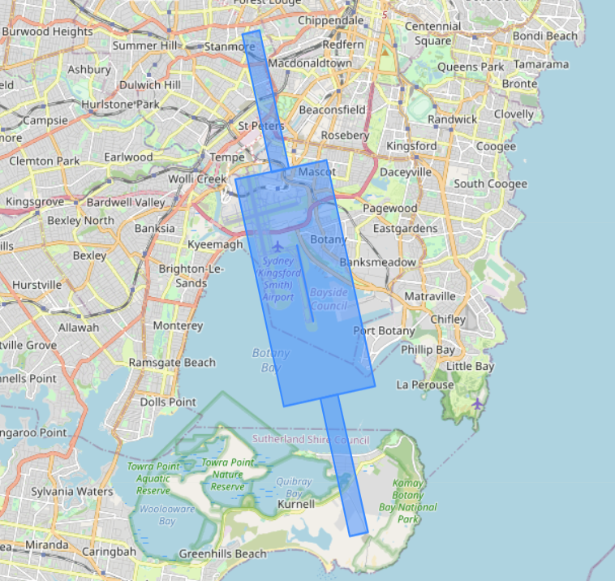
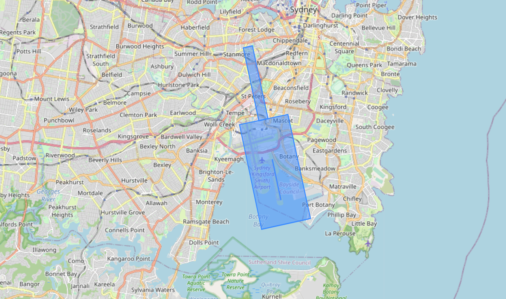
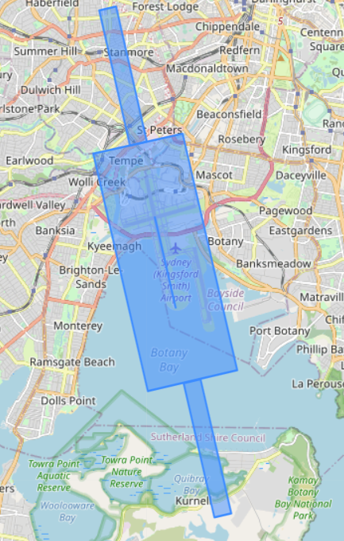

# Runway Protection Zone Generator

Regulating the impact of 5G base stations on Radio altimeters involves the drawing of exclusion and restriction zones around airport runways. The Runway Protection Zone Generator contains python functions which ease the automation of this process.

## Working with Topographic Data

Automation of the zone creation relies on accurate data from a reliable source. The Geoscience Australia GEODATA TOPO 250K Series 3 dataset was chosen as the source for this project. Whilst the dataset contains information on runway centrelines, it does not provide appropriate context. The runwayZoneGenerator.py file contains functions which builds a composite dataset containing runway centrelines and airport name. Refer to docstrings for usage instructions.

GEODATA TOPO 250K Series 3 Shapefile:

<https://ecat.ga.gov.au/geonetwork/srv/eng/catalog.search#/metadata/64058>

## Issues with GEODATA TOPO 250K Series 3

- Outdated entries, latest update 2006 ~ 2009
- Multiple runway centrelines for intersected runways
- Low precision when rendered in Google Earth Pro/ArcMap

## Example Symmetrical Protection Zone Output

## Example Asymmetrical Protection Zone Output

## Faulty Bisected Runway

Issues with database accuracy can manifest into improper zones being drawn.

